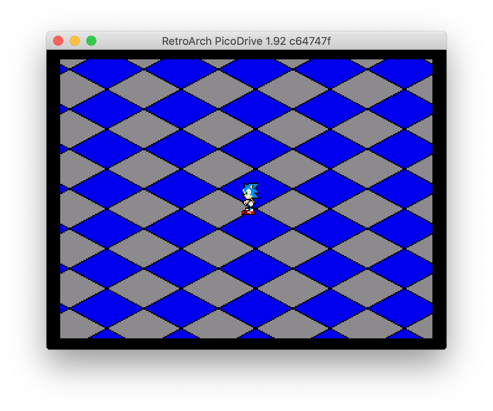

Learning how to display Mega Drive graphics in 68000 assembly.

I use the m68k [vasm assembler](http://sun.hasenbraten.de/vasm/index.php?view=main) with Motorola syntax, and the Mega Drive startup kit from the awesome [Gamehut](https://www.youtube.com/channel/UCfVFSjHQ57zyxajhhRc7i0g) Youtube channel.

## Prerequisites

Download the vasm tarball and build `vasmm68k_mot` with these options from [the compilation instructions](http://sun.hasenbraten.de/vasm/index.php?view=compile):

    make CPU=m68k SYNTAX=mot

Now you need to have the `vasmm68k_mot` executable in your path somehow, see how it's done on your OS / shell.

## Build the rom.bin file

To build the `bin/rom.bin` file from the assembly source code, run:

    make

## Run the rom.bin file

Open the generated `bin/rom.bin` file in your favourite Mega Drive emulator, it should display a scrolling checkboard :)

There is a `run` target in the Makefile, but it won't work for you unless you override the `EMULATOR_PATH`, `EMULATOR_CMD`, and `ROM_PATH` env variables. Chances are you don't have the same emulator installed in the exact same path as I do :)

## References

- vasm assembler: <http://sun.hasenbraten.de/vasm/index.php?view=main>
- Startup kit: <https://www.youtube.com/watch?v=PSYhSmXBgIw>
- 68000 instructions tutorial: <http://mrjester.hapisan.com/04_MC68/Index.html>
- Another Mega Drive tutorial: <https://huguesjohnson.com/programming/genesis/palettes/>
